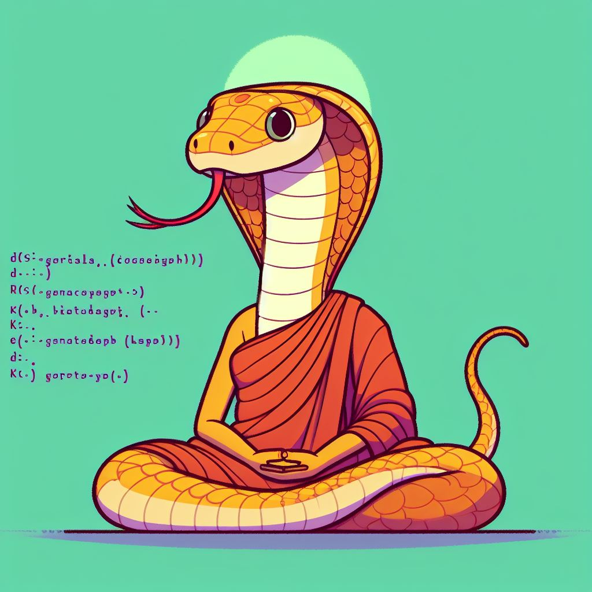

# Capítulo 1. Introducción a Python.

## ¿Qué es Python? 

Python es un **lenguaje de de programación de alto nivel**. Se caracteriza porque su sintaxis e instrucciones son bastante parecidas al lenguaje natural inglés, lo cual lo convierte en un lenguaje de **alta legibilidad**. 

Python fue desarrollado por  a finales de los 80's principios de los 90's por Guido van Rossum.  


## Características princiapes de Python

1. **Legibilidad**: Python se destaca por su sintaxis clara y legible, lo que facilita la comprensión del código. Por ejemplo, el uso de espacios en lugar de llaves para delimitar bloques de código promueve la legibilidad y la consistencia.
2. **Versatilidad**: Python es conocido por su versatilidad y puede utilizarse en una amplia gama de aplicaciones, desde desarrollo web y scripting hasta análisis de datos, inteligencia artificial y aprendizaje automático. Python es un lenguaje de programación de propósito general más populares en las últimas décadas. 
3. **Amplia biblioteca estándar**: Python cuenta con una amplia biblioteca estándar que proporciona módulos y funciones para realizar diversas tareas, lo que permite a los desarrolladores ahorrar tiempo al no tener que escribir código desde cero. Por ejemplo, el módulo "os" proporciona funciones para interactuar con el sistema operativo, mientras que el módulo "re" permite trabajar con expresiones regulares.
4. **Interpretado y de tipado dinámico**: Python es un lenguaje interpretado, lo que significa que el código se ejecuta línea por línea, lo que facilita la depuración y el desarrollo interactivo. Además, Python es de tipado dinámico, lo que significa que las variables no necesitan ser declaradas con un tipo específico y pueden cambiar de tipo durante la ejecución del programa.
5. **Comunidad y soporte**: Python cuenta con una gran comunidad de desarrolladores que contribuyen con bibliotecas, frameworks y recursos educativos. Esto proporciona un amplio soporte y facilita el aprendizaje y la resolución de problemas.


## ¿Por qué aprender Python?

Python es un lenguaje de programación **versátil** y **poderoso** que ha ganado una gran popularidad en la comunidad de desarrollo en los últimos años. Una de las razones principales por las que deberías aprender Python es su **facilidad de uso** y **legibilidad**. Su sintaxis clara y concisa hace que sea accesible para principiantes, al tiempo que permite a los programadores más experimentados **escribir código de manera eficiente**. Además, Python es conocido por su amplia gama de **aplicaciones**, desde desarrollo web y análisis de datos hasta inteligencia artificial y aprendizaje automático. Esta **versatilidad** lo convierte en una herramienta valiosa para una variedad de proyectos y campos profesionales.

Otra razón para aprender Python es su gran **comunidad** y abundante **documentación**. Esto significa que siempre encontrarás recursos, bibliotecas y frameworks disponibles para ayudarte a resolver problemas y acelerar tu desarrollo. Además, Python es utilizado por grandes empresas como Google, Facebook y Instagram, lo que garantiza que dominar este lenguaje te abrirá puertas en el mundo laboral. 

En resumen, Python es un lenguaje de programación que deberías aprender debido a su **facilidad** de uso, **versatilidad** y **demanda** en la industria.

## Ventajas de Python frente a otros lenguajes de programación

Una de las principales ventajas es su **legibilidad** y **simplicidad**. La sintaxis clara de Python hace que sea fácil de aprender y comprender, lo que puede aumentar la productividad y reducir el tiempo necesario para desarrollar y mantener el código. 

Otra ventaja es la **amplia gama de bibliotecas y frameworks disponibles** para Python. Por ejemplo, la biblioteca de ciencia de datos "Pandas" es ampliamente utilizada para el análisis y manipulación de datos, mientras que el framework web "Django" es popular para el desarrollo de aplicaciones web. Estas bibliotecas y frameworks permiten a los desarrolladores realizar tareas complejas con facilidad, lo que ahorra tiempo y esfuerzo en el desarrollo de software.

Además, Python es **multiplataforma**, lo que significa que un programa escrito en Python puede ejecutarse en varios sistemas operativos sin modificaciones significativas. Esto proporciona una gran flexibilidad y portabilidad a los desarrolladores. 

En resumen, la **legibilidad**, la amplia gama de **bibliotecas** y la **portabilidad** son algunas de las ventajas clave que hacen que Python se destaque frente a otros lenguajes de programación.


## Filosofía de Python




La filosofía de este lenguaje de programación se puede resumir en el **Zen de Python** para acceder a él, basta con escribir el comando ```import this``` dentro de Python. 

```bash
$ python
Python 3.9.12 (main, Apr  5 2022, 06:56:58) 
[GCC 7.5.0] :: Anaconda, Inc. on linux
Type "help", "copyright", "credits" or "license" for more information.
>>> import this
The Zen of Python, by Tim Peters

Beautiful is better than ugly.
Explicit is better than implicit.
Simple is better than complex.
Complex is better than complicated.
Flat is better than nested.
Sparse is better than dense.
Readability counts.
Special cases aren't special enough to break the rules.
Although practicality beats purity.
Errors should never pass silently.
Unless explicitly silenced.
In the face of ambiguity, refuse the temptation to guess.
There should be one-- and preferably only one --obvious way to do it.
Although that way may not be obvious at first unless you're Dutch.
Now is better than never.
Although never is often better than *right* now.
If the implementation is hard to explain, it's a bad idea.
If the implementation is easy to explain, it may be a good idea.
Namespaces are one honking great idea -- let's do more of those!
>>> 
```


### ¿Qué nos dice el zen de Python?

Aquí tienes una descripción detallada de cada uno de los principios:

1. **Hermoso es mejor que feo:** Este principio enfatiza la importancia de escribir código limpio y legible. El código debe ser estéticamente agradable y fácil de entender.

2. **Explícito es mejor que implícito:** Es preferible que el código sea claro en lugar de depender de la magia o suposiciones ocultas.

3. **Simple es mejor que complejo:** Se alienta a buscar la simplicidad en el diseño y la implementación del código.

4. **Complejo es mejor que complicado:** Aunque se busca la simplicidad, a veces la realidad es compleja y el código debe reflejar esa complejidad de manera clara.

5. **Plano es mejor que anidado:** Se prefiere evitar anidar estructuras de control o bloques de código en exceso, ya que puede hacer que el código sea difícil de entender.

6. **Espaciado es mejor que denso:** Se alienta a utilizar espacios en blanco de manera consistente para mejorar la legibilidad del código.

7. **La legibilidad cuenta:** El código debe ser escrito pensando en que será leído por otras personas, por lo que la legibilidad es fundamental.

8. **Los casos especiales no son lo suficientemente especiales como para romper las reglas:** Se debe tratar de seguir las convenciones y reglas establecidas, evitando excepciones innecesarias.

9. **Aunque la practicidad le gana a la pureza:** Es importante que el código sea práctico y útil en la vida real, incluso si no es perfectamente puro desde un punto de vista teórico.

10. **Los errores nunca deben pasar en silencio a menos que se silencien explícitamente:** Los errores y excepciones deben ser manejados de manera explícita en lugar de ser ignorados.

11. **En la cara de la ambigüedad, rechaza la tentación de adivinar:** Si hay ambigüedad en el código, es mejor ser explícito en lugar de hacer suposiciones.

12. **Debe haber una, y preferiblemente solo una, manera obvia de hacerlo:** Se busca la simplicidad y la claridad en el diseño del código.

13. **Aunque esa manera puede no ser obvia al principio a menos que seas holandés:** Este es un guiño humorístico a la nacionalidad de Guido van Rossum, el creador de Python, pero también sugiere que la claridad puede requerir esfuerzo y reflexión.

14. **Ahora es mejor que nunca:** Es mejor actuar y escribir código ahora en lugar de esperar a que sea perfecto en el futuro.

15. **Aunque nunca es a menudo mejor que *ahora* mismo:** Sin embargo, es importante no apresurarse y escribir código de mala calidad solo para terminar rápido.

16. **Si la implementación es difícil de explicar, es una mala idea:** La complejidad excesiva en la implementación puede ser una señal de que el diseño o la solución no son los adecuados.

17. **Si la implementación es fácil de explicar, puede que sea una buena idea:** Una implementación clara y fácil de entender es una señal positiva.

18. **Los espacios de nombres son una gran idea, ¡tengamos más de esos!** Python fomenta el uso de espacios de nombres para evitar conflictos y organizar el código de manera clara.

19. **Hermoso es mejor que feo:** Este principio refuerza la importancia de la estética y la claridad en el código.

Estos principios del "Zen de Python" son una guía valiosa para los programadores que desean escribir código Python de alta calidad y seguir las mejores prácticas de programación.


____

Made with Love ❤️ by [@jelambrar96](https://github.com/jelambrar96)

[](https://www.buymeacoffee.com/jelambrar1)

Enero 2024
