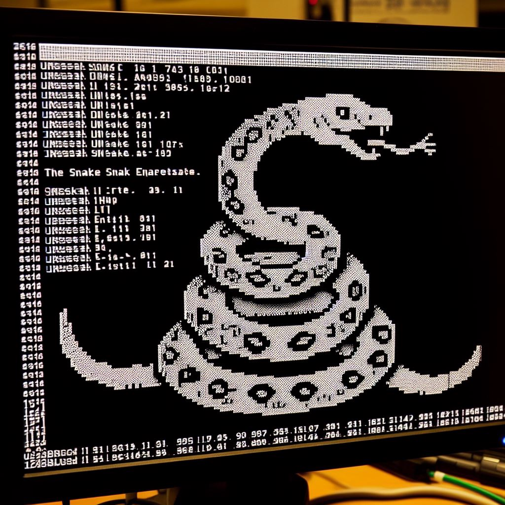

# Capítulo 4. Introducción de datos desde la consola. La función ```input()```.


Ingresar valores por consola en una aplicación de consola es una parte fundamental de la programación, ya que permite la **interacción del usuario** con el programa. En Python, la capacidad de ingresar valores por consola es crucial para crear programas interactivos y dinámicos. Aquí tienes una descripción detallada de la importancia de ingresar valores por consola en una aplicación de consola y en Python:

1. **Interactividad:** Al permitir que los usuarios ingresen valores por consola, los programas se vuelven interactivos, lo que significa que los usuarios pueden proporcionar información o tomar decisiones que afectan el comportamiento del programa.

2. **Flexibilidad:** La entrada por consola permite que un programa pueda manejar una amplia gama de datos, ya que los usuarios pueden ingresar diferentes valores según sea necesario. Esto hace que los programas sean más flexibles y adaptables a diferentes situaciones.

3. **Pruebas y depuración:** Al permitir la entrada por consola, los programadores pueden probar y depurar sus programas más fácilmente, ya que les permite ingresar valores específicos para verificar el comportamiento del programa en diferentes escenarios.

## La funcion ```input()```


En Python, la función `input()` se utiliza para recibir la entrada del usuario por consola. Por ejemplo:

```python
nombre = input("Por favor, ingrese su nombre: ")
print("Hola, " + nombre + ". Bienvenido.")
```

En este ejemplo, el programa solicita al usuario que ingrese su nombre por consola, y luego imprime un saludo personalizado utilizando el nombre ingresado.

En resumen, la entrada por consola es importante en Python y en la programación en general, ya que permite la interacción con el usuario, hace que los programas sean más flexibles y facilita las pruebas y la depuración.

## Tipos de datos y la función input()


En Python, cuando obtienes datos del usuario utilizando la función `input()`, estos datos se almacenan como cadenas de texto (strings). 

```python
in_str = input("Ingresa algo: ")
print(type(in_str)) # Esto imprimirá <class 'str'>
```

Si deseas convertir estos datos a valores numéricos (enteros o números de punto flotante), puedes utilizar las funciones de conversión de tipo integradas en Python. Aquí tienes una descripción detallada de cómo hacerlo:

1. **Convertir a Entero (int):** Puedes utilizar la función `int()` para convertir una cadena de texto a un entero. Por ejemplo:

```python
edad_str = input("Ingrese su edad: ")
edad = int(edad_str)
print(type(edad)) # Esto imprimirá <class 'int'>
```

En este ejemplo, el valor ingresado por el usuario se almacena como una cadena de texto en la variable `edad_str`, y luego se convierte a un entero utilizando la función `int()` y se almacena en la variable `edad`.

1. **Convertir a Flotante (float):** Si esperas que el usuario ingrese un número de punto flotante, puedes utilizar la función `float()` para realizar la conversión. Para ingresar datos de tipo flotante se usa el punto `.` como separador de las cifras decimales. Por ejemplo:

```python
altura_str = input("Ingrese su altura en metros: ")
altura = float(altura_str)
print(type(altura)) # Esto imprimirá <class 'float'>
```

En este caso, el valor ingresado por el usuario se convierte a un número de punto flotante utilizando la función `float()`.



Es importante tener en cuenta que al realizar estas conversiones, debes asegurarte de que los datos ingresados por el usuario sean válidos para el tipo al que estás intentando convertirlos. Por ejemplo, si el usuario ingresa una cadena de texto que no representa un número válido, se producirá un error al intentar convertirla a un entero o un flotante.

Al convertir datos de entrada de la función `input()` a valores numéricos, puedes realizar cálculos matemáticos con ellos o utilizarlos en cualquier contexto donde se requieran valores numéricos.

____

Made with Love ❤️ by [@jelambrar96](https://github.com/jelambrar96)

[](https://www.buymeacoffee.com/jelambrar1)

Enero 2024